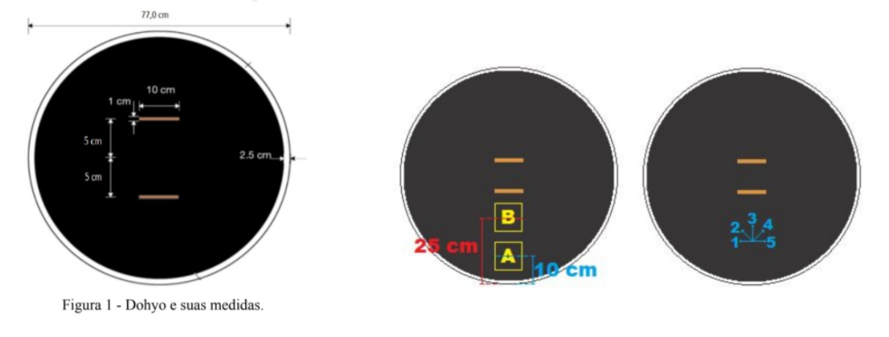
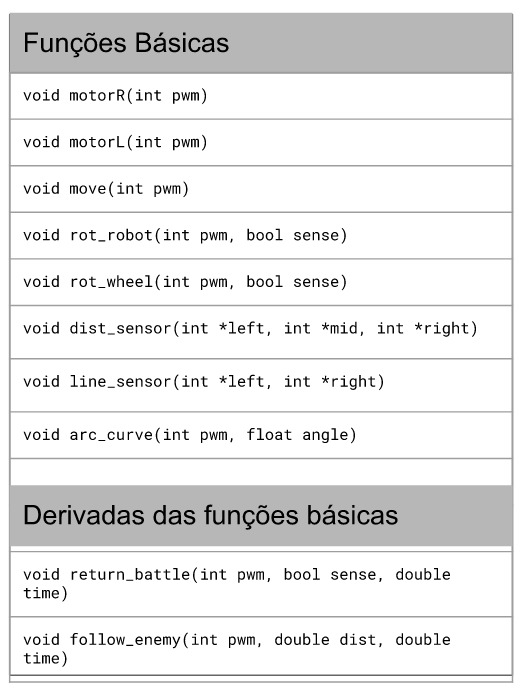
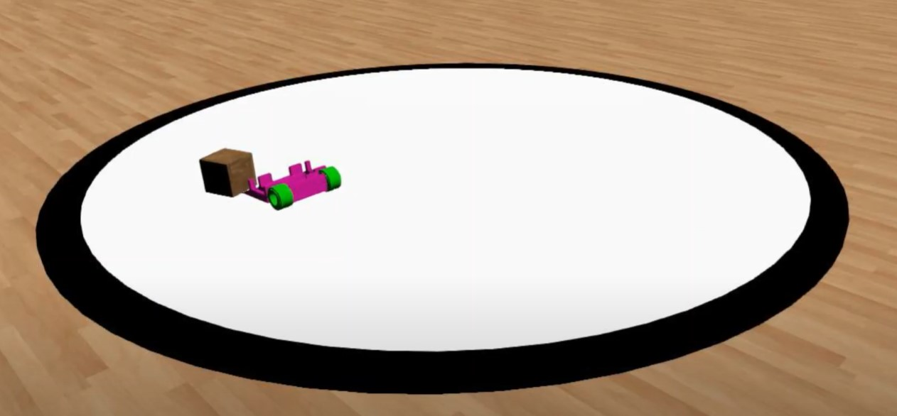

# Mini-Sumo 2021 (Espotinho)

Esse projeto foi desenvolvido para servir de base para a participação da competição Mini-Sumo 500g, representando a equipe Atenas - USP (Grupo SEMEAR). Tal categoria de competição, consiste em robôs autônomos de no máximo 500g com o objetivo de empurrar o oponente para fora do Dohyo (arena). 

<p align="center">
  <a href="#Projeto">Projeto</a> &nbsp; • &nbsp;
  <a href="#Organização">Organização</a> &nbsp; • &nbsp;
  <a href="#A fazer">Como testar</a> &nbsp; • &nbsp;
  <a href="#Tecnologias">Tecnologias</a>
</p>

## Projeto

Retomando os objetivos da competição de forma mais detalhada, ela é realizada num sistema de rodadas, nos quais os robôs são colocados em posições iniciais numa arena, como está exemplificado na figura abaixo, junto as dimensões do Dohyo. Vale ressaltar que a posição inicial do robô é escolhida pela equipe, assim como a estratégia que ele realizará na rodada.
<h2 align="center">
    
</h2>

Para criar uma base lógica para sua futura utilização na implementação do controle de um robô desenvolvido para competições dessa categoria foi desenvolvida um algoritmo com um conjunto de funções que foram julgadas bases para formação de qualquer estratégia, considerando um desenvolvimento de um robô com 2 rodas. Desse modo, foi pensando em como modularizar qualquer possível movimentação do robô em determinada estratégia. Para tanto, foi utilizado o <i>framework</i> Arduino para escrever o código na plataforma PlatformIO disponível como extensão do VSCode. Além disso, foi considerando a utilização de um microcontrolador também do tipo Arduino.

<h2 align="center">
    
</h2>

Com tais funções é possível executar o controle dos motores, verificar os sensores de linha e distância, fazer movimentações para todas direções e curvas. Para facilitar a construção dos algoritmos das estratégias foi criado duas funções derivadas dessas funções, denominadas, básicas:

- <b>return_battle</b>: Executa uma rotação no eixo da roda para retirar o robô da linha externa do Dohyo (borda)
- <b>follow_enemy</b>: Executa um método de busca que verifica os sensores de distância e realiza ajustes de sentido para ir em direção ao oponente

Por fim, foi adaptado tais códigos para o simulador <i>Webots</i>, junto a implementação de um CAD no ambiente para poder construir protótipos de estratégias e testá-las sem a necessidade da finalização da construção física do robô.

<h2 align="center">
    
</h2>

## Organização

Para o projeto foi utilizado a seguinte árvore de arquivos:

- <b>assets</b>: Arquivos adicionais 
    - <b>docs</b>: Arquivos relacionados a competições
    - <b>images</b>: Imagens utilizadas
- <b>controller</b>: Arquivos de implementação no microcontrolador
    - <b>lib</b>: Biblioteca desenvolvida com funções básicas
    - <b>src</b>: Algoritmo main
- <b>webots</b>:  Arquivos de implementação no simulador
    - <b>libraries</b>: Biblioteca desenvolvida com funções básicas
    - <b>source</b>: Algoritmo main

## Como testar

Para testar os códigos no simulador, primeiramente se deve fazer o download do mesmo no seguinte <a href="https://cyberbotics.com/">link</a>. Vale ressaltar que o simulador é gratuito e open source.

Com isso, se deve abrir o ambiente disponibilizado no simulador e acessar a pasta do mundo, adicionando os arquivos de controle presentes nesse repositório, incluindo o makefile. A seguir o comando no terminal necessário para baixar esse repositório:

```shell
$ git clone https://github.com/Grupo-SEMEAR-USP/Mini-Sumo2021.git
```

## Tecnologias

Por fim, durante o desenvolvimento desse repositório foram utilizadas as seguintes tecnologias:

- C/C++
- Webots
- Framework Arduino
- PlatformIO

---

Desenvolvido por Francisco Affonso e Gianluca Capezzuto